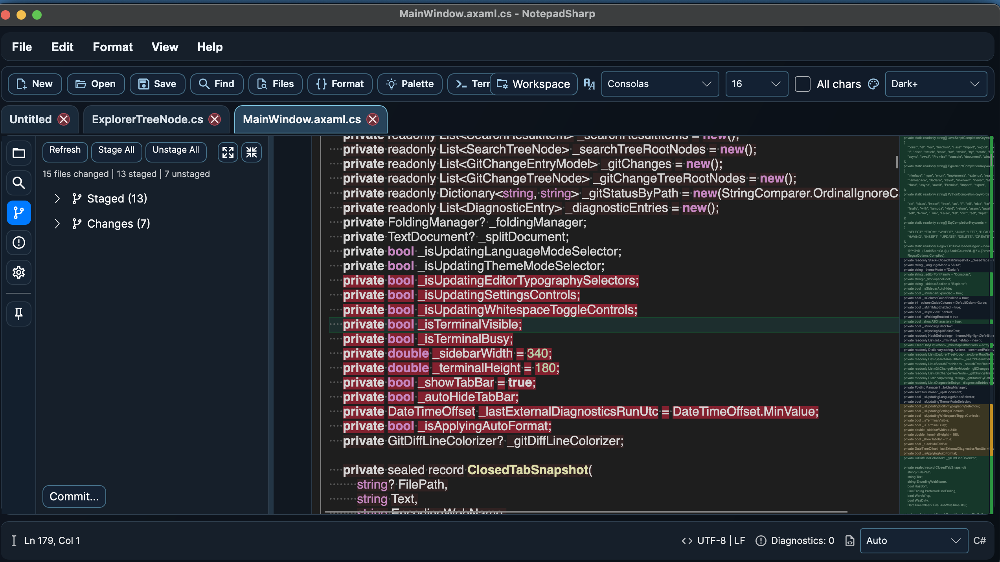

# NotepadSharp

NotepadSharp is a modern, open source, cross-platform editor built with .NET and Avalonia.
It started as a clean Notepad replacement and is evolving into a practical daily driver for code and text editing.

## Screenshot



> Put the latest app screenshot at `docs/images/notepadsharp-ui.png`.

## What You Get Today

- Fast text editing with tabs, unsaved-change indicators, and recovery support.
- VS Code inspired UI with light and dark themes.
- Syntax highlighting and language modes (`Auto`, `Plain Text`, `C#`, `JSON`, `XML`, `YAML`, `Markdown`, `JavaScript`, `TypeScript`, `Python`, `SQL`, `HTML`, `CSS`).
- Find/replace in the current file plus search/replace across workspace files.
- Explorer tree with file/folder operations (new, rename, delete, drag and drop).
- Source control pane with grouped `Staged` and `Changes`, stage all, unstage all, and commit flow.
- Inline Git diff colors plus ruler/minimap diff markers.
- Code folding, column guide, line numbers, split editor, and minimap.
- Whitespace rendering options (tabs/spaces/all characters).
- Built-in terminal panel.
- Editor typography controls (font family and font size) with persisted settings.

## Why This Project

NotepadSharp is designed to be:

- Friendly for normal text editing.
- Powerful enough for everyday coding tasks.
- Easy for contributors to understand and improve.

## Quick Start

Requirements:

- .NET SDK (see `global.json`; current target is .NET 10).

If your .NET SDK is under `~/.dotnet`:

```bash
export DOTNET_ROOT="$HOME/.dotnet"
export PATH="$HOME/.dotnet:$PATH"
```

Build and run:

```bash
dotnet restore
dotnet build --nologo
dotnet test --nologo
dotnet run --project src/NotepadSharp.App/NotepadSharp.App.csproj --no-build
```

## Performance Benchmarks

Use the benchmark runner to measure large-file behavior and track regressions:

```bash
dotnet run --project tests/NotepadSharp.Perf/NotepadSharp.Perf.csproj -c Release
```

Quick mode (faster local smoke run):

```bash
dotnet run --project tests/NotepadSharp.Perf/NotepadSharp.Perf.csproj -c Release -- --quick
```

Custom line count:

```bash
dotnet run --project tests/NotepadSharp.Perf/NotepadSharp.Perf.csproj -c Release -- --lines 50000
```

Current benchmark scenarios:

- Load large document from disk (`TextDocumentFileService.LoadAsync`).
- Reload existing document from disk (`TextDocumentFileService.ReloadAsync`).
- Search/count matches (plain and regex) with `TextSearchEngine`.
- Save normalized output (`TextDocumentFileService.SaveAsync`).

## Project Layout

- `src/NotepadSharp.App` - Avalonia desktop app.
- `tests` - automated test projects.
- `docs` - screenshots and future docs.

## Contributing

Contributions are welcome from beginners and experienced developers.

How to jump in:

1. Check open issues (`good first issue` and `help wanted` are great starting points).
2. Open an issue first for large features to align scope.
3. Create a focused branch and keep PRs small and reviewable.
4. Run build/tests locally before opening a PR.
5. For UI changes, include before/after screenshots in the PR.

Good contribution areas right now:

- Editor UX polish (layout, spacing, accessibility, keyboard flow).
- Git experience (file-level stage/unstage, conflict handling, richer diff navigation).
- Search and replace improvements.
- Performance with large files and very large repositories.
- More tests around state persistence and editor behaviors.

Detailed contribution guide: [CONTRIBUTING.md](CONTRIBUTING.md)

## Community and Safety

- Be respectful: [CODE_OF_CONDUCT.md](CODE_OF_CONDUCT.md)
- Report vulnerabilities privately: [SECURITY.md](SECURITY.md)

## Releases

- CI runs on every push and pull request.
- Create a tag (example: `v0.1.0`) to produce release artifacts.
- You can also trigger the `Release` workflow manually in GitHub Actions.

## License

Licensed under the GPL-3.0 License. See [LICENSE](LICENSE).
